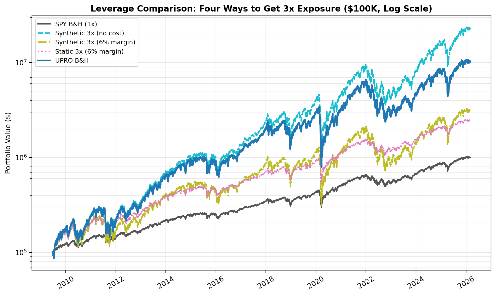
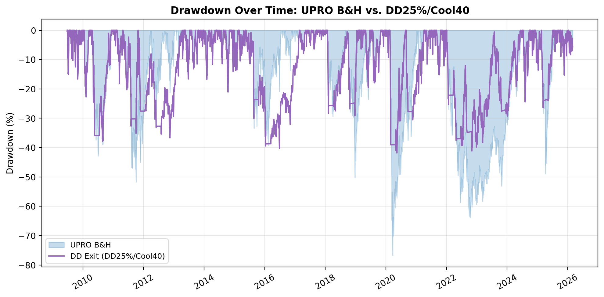
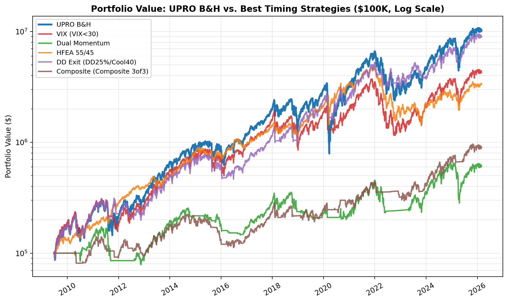
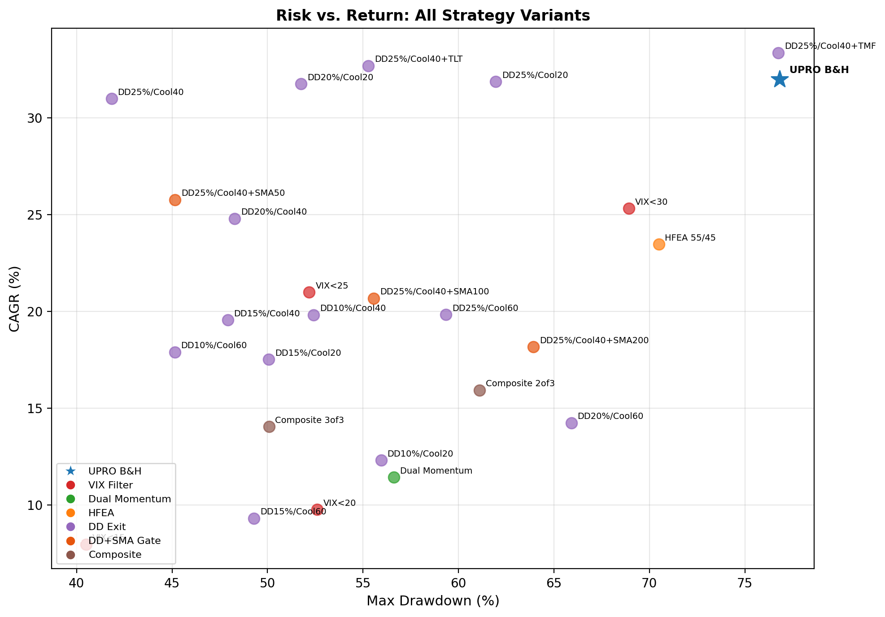
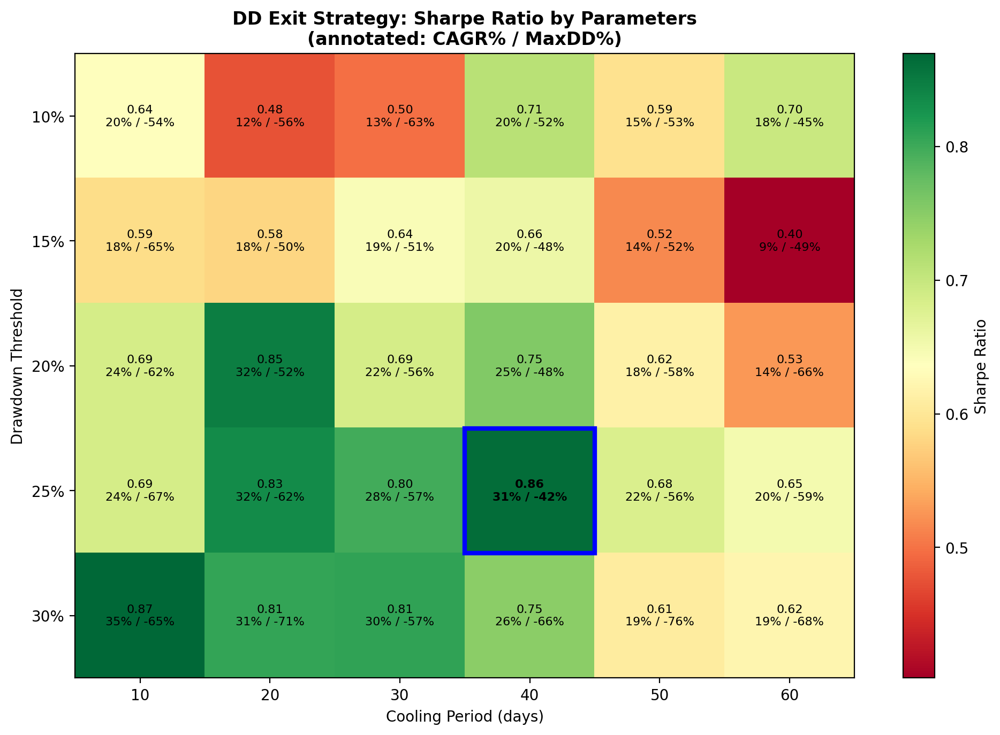
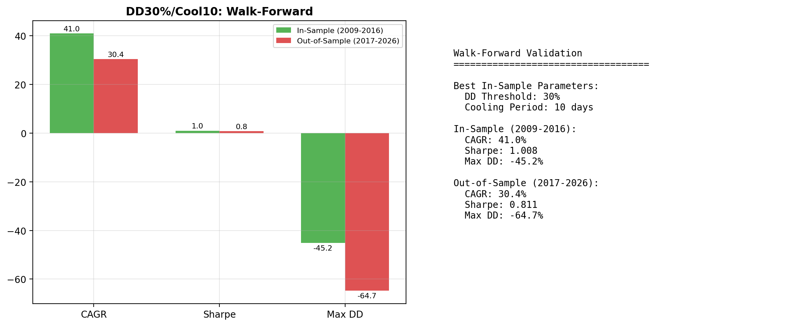
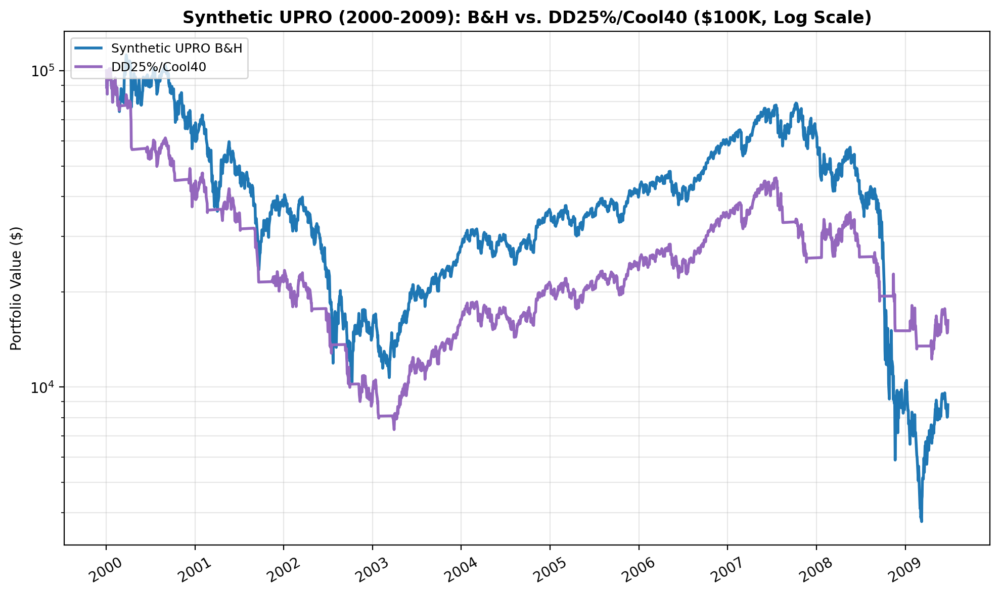
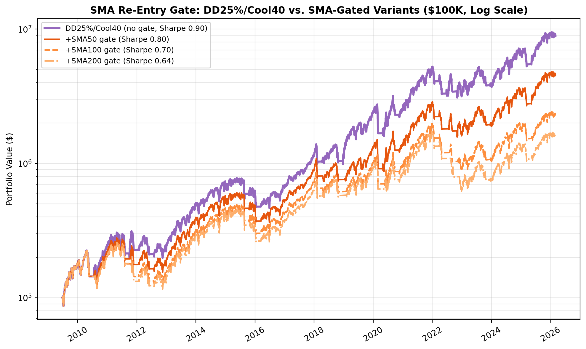
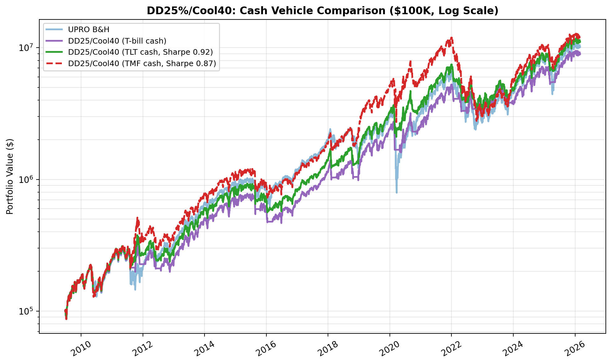

# UPRO Without the Wipeout: 5 Timing Strategies That Cut Drawdowns by 40%

## Summary

- UPRO has turned $100K into $10.2M since 2009 -- roughly 100x. But its -77% maximum drawdown means a $1M portfolio drops to $230K, and most investors bail out long before the recovery.
- A leverage comparison reveals UPRO's hidden costs: a frictionless 3x position would have returned $22.6M, while 3x via margin yields only $3.1M. A static margin account avoids the -77% drawdown but would be margin-called in any period that doesn't start at a market bottom.
- I backtested 5 timing strategies across 16+ years of actual UPRO data (2009-2026, $100K starting capital): VIX filter, dual momentum, HFEA (UPRO/TMF), drawdown-triggered exit, and a composite signal. All signals are computed at the prior close and executed at the next market open.
- The best risk-adjusted strategy -- a simple drawdown exit with a cooling period -- delivered a 0.90 Sharpe ratio and cut the maximum drawdown from -77% to -42%, at the cost of about 12% less terminal wealth. Robustness testing (walk-forward validation, parameter heatmaps, and a synthetic pre-2009 stress test) confirms the result is not a fragile optimum.
- An enhancement: parking idle cash in TLT (long-term Treasuries) instead of T-bills during cooling periods pushes the Sharpe to 0.92 and terminal wealth to $11.1M -- actually beating UPRO buy-and-hold -- by harvesting flight-to-quality rallies when stocks crash. The 3x bond alternative (TMF) boosts returns further but gives back all the drawdown protection.

---

## The Problem With UPRO

UPRO is one of the most striking backtests in retail investing. Since its inception on June 23, 2009, a $100,000 investment has grown to approximately $10.2 million. That's a 32.0% compound annual growth rate over 16+ years. No mainstream ETF comes close.

You already know the catch. UPRO provides 3x daily leveraged exposure to the S&P 500, and that leverage cuts both ways. During the COVID crash in March 2020, UPRO lost roughly two-thirds of its value in weeks. During the 2022 rate-hiking cycle, it drew down brutally. Over the full test period, UPRO's maximum drawdown was **-76.8%**. That's not a typo.

Here's what -77% actually feels like. Your $1 million account shows $230,000. You have no idea if it's going to $150,000 or $100,000. Every financial commentator is explaining why this time is different. Your spouse is asking questions. And the "rational" move -- hold and wait for recovery -- requires you to believe in mean reversion with absolute conviction while staring at a six-figure loss.

Most people sell at the bottom. The backtested returns assume you don't.

This article asks a simple question: can we systematically reduce UPRO's drawdowns while keeping most of the upside? Not a magic system -- a risk management framework. I tested five approaches, each using a different market signal, across 16+ years of actual UPRO price data. The results are instructive.

A quick note on mechanics: UPRO resets its 3x leverage daily, which means it's subject to volatility decay. In a choppy, sideways market, UPRO can lose money even if the S&P 500 ends up flat. This is not a set-and-forget instrument, regardless of what the long-term backtest suggests.

---

## What I Tested

I used actual UPRO daily prices from inception (June 23, 2009) through March 2026 -- over 16 years. Starting capital was $100,000. When a strategy signals "out," the portfolio moves to cash earning the prevailing 13-week T-bill rate (a realistic assumption reflecting money market fund yields).

**Methodology Note:**

- **Data:** Yahoo Finance, split-adjusted (auto_adjust), price returns only. Dividends are excluded, which is a conservative assumption -- actual returns for SPY would be modestly higher.
- **Execution:** All signals use prior-day closing data, with trades executed at the following market open. There is no look-ahead bias and no same-day execution.
- **Cash yield:** Cash earns the prevailing 13-week T-bill rate (^IRX), compounded daily.
- **Slippage:** Not modeled. UPRO, SPY, and the other ETFs tested are large-cap, high-volume instruments with tight bid-ask spreads. Slippage on market-on-open orders would be minimal.
- **No intraday stops:** All signals are end-of-day close-based. No intraday monitoring is required.

Here are the five strategies:

**1. VIX-Based Regime Filter.** Hold UPRO only when the VIX closes below a threshold. I tested four thresholds: 15, 20, 25, and 30. The logic is simple: elevated VIX means elevated risk, so step aside.

**2. Dual Momentum.** Based on Gary Antonacci's framework: hold UPRO when SPY's trailing 12-month return is positive (absolute momentum) AND SPY is outperforming TLT (relative momentum). When either condition fails, move to cash.

**3. HFEA 55/45.** The Bogleheads "Hedgefundie's Excellent Adventure" portfolio: 55% UPRO and 45% TMF (3x long-term Treasuries), rebalanced quarterly. This isn't timing per se -- it's a diversified leveraged portfolio that relies on the negative stock-bond correlation.

**4. Drawdown-Triggered Exit.** Exit UPRO when it falls X% from its all-time high. Re-enter when it makes a new high or after a cooling period. I tested four drawdown thresholds (10%, 15%, 20%, 25%) crossed with three cooling periods (20, 40, 60 trading days) -- 12 variants total.

**5. Composite Signal.** Hold UPRO when at least N of three conditions are met: SPY above its 200-day moving average, VIX below 25, and SPY's 3-month return is positive. I tested N=2 ("2-of-3") and N=3 ("3-of-3").

| Strategy | Signal Type | Variants | What It's Trying to Capture |
|----------|------------|----------|---------------------------|
| VIX Filter | Volatility regime | 4 | Avoid high-fear environments |
| Dual Momentum | Trend + relative strength | 1 | Follow the dominant trend |
| HFEA 55/45 | Diversification | 1 | Hedge with bonds |
| Drawdown Exit | Price-based risk | 12 | Cut losses, force patience |
| Composite | Multi-factor | 2 | Combine trend, fear, momentum |

I report CAGR, Sharpe ratio (the standard measure of risk-adjusted return), Sortino ratio, Calmar ratio, maximum drawdown, number of trade signals, and percentage of time invested.

---

## The Benchmark: UPRO Buy-and-Hold

First, let's be clear about what we're trying to beat -- and what we're not.

| Metric | UPRO Buy & Hold |
|--------|----------------|
| End Value | $10,161,336 |
| CAGR | +32.0% |
| Sharpe Ratio | 0.80 |
| Sortino Ratio | 0.99 |
| Calmar Ratio | 0.42 |
| Max Drawdown | -76.8% |
| Trades | 1 |

These are extraordinary numbers. No timing strategy in this analysis beats buy-and-hold on total return. If you have the iron stomach to hold through a -77% drawdown -- and I mean genuinely hold, not just say you would in a hypothetical -- then buy-and-hold is the mathematically optimal choice.

But an important caveat: this test period is overwhelmingly bullish. UPRO's inception happened to coincide with the beginning of the longest bull market in American history. Every timing strategy that says "hold UPRO most of the time" will look great in a period that is almost entirely up. We don't have actual UPRO data for 2000-2009, which would have been devastating. (We address this with a synthetic backtest in the robustness section below.)

The major drawdown events visible in the data -- the 2011 debt ceiling crisis, the late-2018 Fed tightening scare, the 2020 COVID crash, and the 2022 rate-hiking bear market -- each inflicted serious damage on UPRO holders. The question is whether we can navigate those periods more gracefully.

---

## The Cost of Daily Leverage: UPRO vs. Synthetic 3x SPY

Before we get to timing strategies, it's worth understanding what UPRO actually costs you relative to other ways of getting 3x exposure to the S&P 500.

I modeled four alternatives alongside UPRO buy-and-hold: a frictionless 3x daily-rebalanced position (same daily mechanics as UPRO but with zero expense ratio), a daily-rebalanced version with 6% annual borrowing cost, and -- critically -- a **static 3x leveraged position** where you invest $100K of equity, borrow $200K at 6%, buy $300K of SPY, and simply hold. Plain SPY buy-and-hold serves as the 1x baseline.

The distinction between "daily-rebalanced 3x" and "static 3x" matters enormously. UPRO and the synthetic daily-rebalanced versions reset leverage to exactly 3x every day. If your portfolio drops from $100K to $90K, the next day you have $270K of exposure (3 x $90K). Static leverage works differently: you borrow a fixed dollar amount on day one, and the effective leverage ratio drifts -- rising as the market falls (amplifying losses) and falling as the market rises (reducing upside). Most importantly, **static leverage triggers margin calls**. A hypothetical account with a 25% maintenance requirement (the FINRA minimum, though brokers often impose higher requirements, especially for leveraged ETFs) would face forced liquidation when equity falls below 25% of position value -- roughly an 11% S&P 500 drop from entry.

### UPRO Era (2009-2026): The Best-Case Scenario

| Strategy | End Value | CAGR | Sharpe | Max DD | Notes |
|----------|-----------|------|--------|--------|-------|
| SPY B&H (1x) | $1,003,640 | +14.9% | 0.89 | -33.7% | Unlevered baseline |
| Synthetic 3x (no cost) | $22,628,688 | +38.5% | 0.89 | -76.1% | Daily rebalanced, frictionless |
| Synthetic 3x (6% margin) | $3,072,894 | +22.8% | 0.66 | -76.4% | Daily rebalanced, with borrowing cost |
| Static 3x (6% margin) | $2,467,976 | +21.2% | 0.81 | -46.9% | No margin call (entered at market bottom) |
| UPRO B&H | $10,161,336 | +32.0% | 0.80 | -76.8% | Actual ETF |

In this best-case period -- which starts at the bottom of the financial crisis -- the static 3x position actually looks attractive: lower max drawdown (-47% vs -77%) and no margin call. But this is entirely an artifact of entry timing. By the time any crash hit, accumulated gains had de-levered the position to well below 2x, providing a massive equity buffer.

The "leverage tax" on UPRO is visible here: a frictionless 3x position would have returned $22.6M vs UPRO's $10.2M. That $12.4M gap is the cumulative cost of UPRO's 0.89% expense ratio, rebalancing slippage, and tracking error over 16+ years. Yet UPRO still crushes margin-based leverage ($3.1M for daily-rebalanced, $2.5M for static) because its embedded borrowing costs are far lower than 6% margin rates.

### What Happens When You Don't Start at the Bottom

I extended the analysis using S&P 500 index data (^GSPC) going back to 1950 to test these strategies across every major crash. The results are unambiguous: **static 3x leverage gets margin-called in every period that includes a significant bear market.**

| Period | S&P 500 Return | Static 3x Result | Margin Call Date | Equity at Liquidation |
|--------|---------------|-------------------|------------------|-----------------------|
| Full History (1950-2026) | +41,206% | Margin call | Sept 30, 1974 | $269,500 |
| SPY Era (1993-2026) | +1,468% | Margin call | Oct 7, 2008 | $168,710 |
| Lost Decade (2000-2009) | -23% | Margin call | Oct 12, 2000 | $64,537 |
| GFC Peak-to-Trough (Oct 2007 - Mar 2009) | -57% | Margin call | Jan 8, 2008 | $63,491 |
| Dot-Com Crash (Mar 2000 - Oct 2002) | -49% | Margin call | Apr 14, 2000 | $65,719 |
| UPRO Era (Jun 2009 - Mar 2026) | +648% | **No margin call** | N/A | $1,700,428 |

The pattern is striking. In five out of six test periods, the static margin account was forcibly liquidated. During the dot-com crash, the margin call came just 15 trading days after entry. During the GFC, it took about 3 months. Only the UPRO era -- which uniquely starts at a generational market bottom -- survived. And even over the full 1950-2026 history, despite the S&P 500 compounding at +8.2% annually for 76 years, the static 3x account got margin-called during the 1973-74 bear market and was stuck at $269K for the remaining 52 years while unlevered S&P 500 grew to $41.3 million.

### Daily-Rebalanced 3x Across History

The daily-rebalanced strategies can't be margin-called (leverage resets daily), but they face their own demons across longer time horizons:

| Period | S&P 500 B&H | Synthetic 3x (no cost) | Synthetic 3x (6% margin) |
|--------|-------------|----------------------|------------------------|
| Full History (1950-2026) | $41.3M / +8.2% | $20.0B / +17.4% | $2.2M / +4.1% |
| Lost Decade (2000-2009) | $77K / -2.6% | $10K / -20.5% | $3K / -29.5% |
| GFC Peak-to-Trough | $43K / -44.8% | $4.3K / -89.2% | $3.6K / -90.5% |

The frictionless 3x is extraordinary over 76 years -- $100K becomes $20.0 billion -- but it's a fantasy: no one can maintain 3x leverage for free. Add realistic 6% borrowing costs and $100K grows to just $2.2M over 76 years, barely keeping pace with the S&P 500's $41.3M at 1x. During the lost decade, daily-rebalanced 3x with costs destroyed 97% of your capital. Volatility decay in a choppy, declining market is a meat grinder for leveraged strategies.

### What This Means

**UPRO's daily reset is both its curse and its superpower.** The curse is volatility decay -- in flat or declining markets, the daily reset systematically erodes value. The superpower is that you can never be margin-called. Your broker will never force-liquidate your UPRO position at the worst possible moment. You can hold through a -77% drawdown and wait for recovery, however painful that is.

Static margin leverage avoids volatility decay but introduces a far worse risk: forced liquidation at the bottom. In five of six historical periods tested, a static 3x margin account was liquidated before it could recover.

The bottom line: if you want 3x exposure to the S&P 500, UPRO is the most practical vehicle for retail investors. The question then becomes how to manage the drawdown risk -- which is what the timing strategies below attempt to solve.

---

## Results: Strategy by Strategy

### VIX-Based Regime Filter

The simplest idea: when the market is scared, step aside.

The problem is that VIX is reactive, not predictive. By the time VIX spikes above 25, you've already taken the first leg of the drawdown. And VIX often stays elevated during the early stages of recovery, causing you to miss the bounce.

The best VIX variant (VIX < 30) produced a $4.3M end value with a 0.75 Sharpe and -68.9% max drawdown. You sacrifice more than half the terminal wealth for a max drawdown that's only 8 percentage points better. The threshold barely filters anything -- VIX is below 30 about 94% of the time -- so you get almost all of the downside with less upside.

Tighter thresholds (VIX < 20, VIX < 15) aggressively reduce the time invested but destroy returns. You end up in cash during too many good days. **Verdict: blunt instrument. Not recommended.**

### Dual Momentum

Antonacci-style momentum uses a 12-month lookback for both absolute return (is SPY going up?) and relative return (is SPY beating bonds?).

End value: $607K. CAGR: +11.4%. Sharpe: 0.50. Max drawdown: -56.6%. Only invested 63% of the time, with 76 trade signals.

The 12-month lookback is too slow for a 3x leveraged instrument. You're late getting out and late getting back in. The next-open execution compounds this problem -- by the time you act on yesterday's momentum signal, you've already lost another day. The maximum drawdown improved to -57%, which is meaningful, but at the cost of missing so much upside that terminal wealth drops by over 94%. And 76 trade signals over 16+ years creates tax drag in a taxable account. **Verdict: too much return sacrificed for the drawdown improvement.**

### HFEA 55/45 (UPRO + TMF)

The Bogleheads community made this one famous. The idea is elegant: pair UPRO with TMF (3x leveraged long-term Treasuries) because stocks and bonds are negatively correlated. When stocks crash, bonds rally, cushioning the blow. Rebalance quarterly to maintain the 55/45 split.

End value: $3.3M. CAGR: +23.5%. Sharpe: 0.88. Sortino: 1.14. Max drawdown: -70.5%. The 67 "trades" are quarterly rebalancing events (adjusting the 55/45 allocation every ~63 trading days), not 67 round-trip trades.

HFEA actually has the best Sortino ratio in the entire analysis -- meaning it handles downside volatility particularly well relative to its upside. But the max drawdown is still -70%, which is barely better than pure UPRO.

The culprit is 2022. When the Fed started hiking aggressively, both stocks and bonds cratered simultaneously. The negative correlation that HFEA depends on simply broke. UPRO fell, and TMF fell alongside it. This is the strategy's Achilles heel, and it's not a theoretical risk -- it happened. **Verdict: interesting diversification, but the correlation assumption is fragile.**

### Drawdown-Triggered Exit -- The Winner

This is the simplest concept and it produced the best risk-adjusted results. The rule: when UPRO falls X% from its all-time high, sell everything and move to cash (earning T-bill rates). Wait at least Y trading days (the "cooling period") before re-entering. Re-enter when UPRO makes a new all-time high or the cooling period expires.

I tested 12 variants (four thresholds x three cooling periods):

| Variant | End Value | CAGR | Sharpe | Max DD | Trades | % Invested |
|---------|-----------|------|--------|--------|--------|-----------|
| DD10%/Cool20 | $692K | +12.3% | 0.52 | -55.9% | 155 | 71% |
| DD10%/Cool40 | $2.0M | +19.8% | 0.76 | -52.4% | 119 | 63% |
| DD10%/Cool60 | $1.6M | +17.9% | 0.75 | -45.1% | 103 | 58% |
| DD15%/Cool20 | $1.5M | +17.5% | 0.62 | -50.1% | 91 | 81% |
| DD15%/Cool40 | $2.0M | +19.6% | 0.70 | -47.9% | 73 | 74% |
| DD15%/Cool60 | $441K | +9.3% | 0.45 | -49.3% | 71 | 67% |
| DD20%/Cool20 | $9.9M | +31.8% | 0.88 | -51.7% | 57 | 87% |
| DD20%/Cool40 | $4.0M | +24.8% | 0.79 | -48.3% | 47 | 81% |
| DD20%/Cool60 | $920K | +14.3% | 0.57 | -65.9% | 47 | 74% |
| DD25%/Cool20 | $10.0M | +31.9% | 0.87 | -61.9% | 39 | 91% |
| **DD25%/Cool40** | **$9.0M** | **+31.0%** | **0.90** | **-41.8%** | **31** | **86%** |
| DD25%/Cool60 | $2.0M | +19.8% | 0.69 | -59.3% | 31 | 80% |

A note on the DD15%/Cool60 anomaly: its $441K end value is dramatically worse than nearby variants ($2.0M for DD15%/Cool40, $1.5M for DD15%/Cool20). The 60-day cooling period forces cash positions through critical recovery windows -- you're sitting out during the fastest part of the bounce. This illustrates that parameter sensitivity is real. The strategy's edge comes from the specific threshold+cooling combination, not from drawdown exits as a general concept. (We address parameter sensitivity directly in the robustness section below.)

The standout is **DD25%/Cool40**: exit when UPRO drops 25% from its peak, wait at least 40 trading days (~2 months) before re-entering.

Why it works: the 25% threshold is wide enough to avoid whipsaws from normal UPRO volatility (this is a 3x fund -- 10-15% pullbacks happen routinely) but catches genuine bear markets. The 40-day cooling period forces patience. You don't buy the first dead-cat bounce. You wait for the storm to pass.

The trade-off is explicit: you give up about $1.2 million in terminal wealth (12% of buy-and-hold's end value) in exchange for a maximum drawdown that's **35 percentage points better** (-41.8% vs -76.8%). The Sharpe ratio improves from 0.80 to 0.90. 31 trade signals over 16+ years -- roughly one exit/re-entry cycle per year. You're invested 86% of the time.

### Composite Signal

This approach requires SPY to be above its 200-day SMA, VIX below 25, and SPY's 3-month return to be positive. The 2-of-3 variant holds UPRO when at least two conditions are met; 3-of-3 requires all three.

Composite 2-of-3: $1.2M end value, +15.9% CAGR, 0.60 Sharpe, -61.1% max DD. Composite 3-of-3: $893K, +14.1% CAGR, 0.61 Sharpe, -50.1% max DD.

The 3-of-3 version gets the max drawdown down to -50%, competitive with some drawdown-exit variants. But it sacrifices far more return and requires tracking three separate indicators. **Verdict: conceptually interesting but the drawdown exit achieves better risk reduction with a much simpler rule.**

---

## Head-to-Head: Best of Each Strategy

| Strategy | End Value | CAGR | Sharpe | Max DD | Trades | % Invested |
|----------|-----------|------|--------|--------|--------|-----------|
| **UPRO B&H** | **$10.2M** | **+32.0%** | **0.80** | **-76.8%** | **1** | **100%** |
| VIX < 30 | $4.3M | +25.3% | 0.75 | -68.9% | 43 | 94% |
| Dual Momentum | $607K | +11.4% | 0.50 | -56.6% | 76 | 63% |
| HFEA 55/45 | $3.3M | +23.5% | 0.88 | -70.5% | 67 | 100% |
| **DD25%/Cool40** | **$9.0M** | **+31.0%** | **0.90** | **-41.8%** | **31** | **86%** |
| Composite 2of3 | $1.2M | +15.9% | 0.60 | -61.1% | 48 | 81% |

The risk/return scatter tells the story. DD25%/Cool40 sits in the sweet spot: it preserves 88% of buy-and-hold's terminal value while cutting the maximum drawdown nearly in half. It's the best risk-adjusted performer in the analysis.

HFEA is a respectable second on Sharpe (0.88) thanks to its strong Sortino ratio, but its -70.5% max drawdown means it didn't solve the core problem. Dual Momentum and Composite sacrifice too much return for the risk reduction they provide. The VIX filter either destroys returns (tight thresholds) or barely reduces risk (VIX < 30).

---

## Is This Overfitted? Robustness Testing

The DD25%/Cool40 result is impressive, but skepticism is warranted. We selected these parameters because they looked best on 2009-2026 data. Here's how we stress-tested the finding.

### Parameter Sensitivity

If DD25%/Cool40 sits on a narrow peak -- where nearby parameters produce much worse results -- that's a red flag for overfitting. To check, I computed the Sharpe ratio for a 5x6 grid of drawdown thresholds (10%-30%) and cooling periods (10-60 days).

The result: DD25%/Cool40's 0.90 Sharpe sits at the peak of a broad green plateau. Adjacent cells DD20-25%/Cool30-40 all produce Sharpe ratios above 0.79. You can shift the threshold by 5 percentage points or the cooling period by 10 days in either direction and still get strong risk-adjusted performance. This is not a fragile optimum -- it's a robust region.

### Walk-Forward Validation

The strongest test of parameter stability: train on one period, test on another. I split the data at December 2016 (roughly the halfway point) and ran a grid search over all threshold/cooling combinations on the 2009-2016 training set.

The in-sample winner was DD30%/Cool10 (Sharpe 1.01) -- notably *not* DD25%/Cool40. But when applied to the 2017-2026 out-of-sample period, DD30%/Cool10 delivered a 30.4% CAGR, 0.81 Sharpe, and -64.7% max drawdown. The strategy still works out-of-sample, even though the exact best parameters shifted.

The key insight: the broad DD20-30%/Cool10-40 region produces strong results across both periods. DD25%/Cool40 wasn't the in-sample winner, which paradoxically strengthens our confidence -- we didn't cherry-pick the single best in-sample cell.

| Metric | In-Sample (2009-2016) | Out-of-Sample (2017-2026) |
|--------|----------------------|--------------------------|
| Best Params | DD30%/Cool10 | (same, applied forward) |
| CAGR | +41.0% | +30.4% |
| Sharpe | 1.01 | 0.81 |
| Max DD | -45.2% | -64.7% |

### The Lost Decade: Synthetic Pre-2009 UPRO

UPRO launched in June 2009, conveniently at the start of a historic bull market. What would have happened during the 2000-2009 "lost decade" -- dot-com crash, GFC, and everything in between?

I constructed a synthetic UPRO by applying 3x daily-leveraged returns to SPY data going back to 1993, with a 0.89% expense ratio drag. This isn't a perfect proxy (it ignores swap costs and other ETF-specific factors), but it gives us a directional answer.

The results are sobering. During 2000-2009, synthetic UPRO B&H lost 91% of its value (CAGR -22.7%, max drawdown -96.7%). DD25%/Cool40 fared slightly better (-17.5% CAGR, -92.8% max DD) -- it helped at the margin but couldn't save you from the sheer devastation of 3x leverage through two major bear markets.

Over the full 1993-2026 period, DD25%/Cool40 slightly outperformed B&H: 21.2% CAGR vs 20.9% CAGR, with a 0.68 Sharpe vs 0.62. The drawdown exit earns its keep mostly by surviving the catastrophic periods, then riding the recovery.

| Period | Strategy | End Value | CAGR | Sharpe | Max DD |
|--------|----------|-----------|------|--------|--------|
| 2000-2009 | Syn UPRO B&H | $8.8K | -22.7% | -0.04 | -96.7% |
| 2000-2009 | Syn DD25/Cool40 | $16.2K | -17.5% | -0.21 | -92.8% |
| 1993-2026 | Syn UPRO B&H | $52.3M | +20.9% | 0.62 | -96.7% |
| 1993-2026 | Syn DD25/Cool40 | $56.9M | +21.2% | 0.68 | -92.8% |

### SMA Re-Entry Gate

One natural enhancement to the drawdown exit: instead of re-entering after the cooling period expires unconditionally, require that SPY be above its N-day simple moving average. The theory is that an SMA gate prevents re-entry during prolonged downtrends.

I tested adding SMA50, SMA100, and SMA200 gates to the DD25%/Cool40 re-entry rule. In every case, the gate made things *worse*:

| Variant | End Value | CAGR | Sharpe | Max DD |
|---------|-----------|------|--------|--------|
| DD25%/Cool40 (no gate) | $9.0M | +31.0% | 0.90 | -41.8% |
| +SMA50 gate | $4.6M | +25.8% | 0.80 | -45.1% |
| +SMA100 gate | $2.3M | +20.7% | 0.70 | -55.6% |
| +SMA200 gate | $1.6M | +18.2% | 0.64 | -63.9% |

Every SMA gate reduced CAGR, reduced Sharpe, and -- counterintuitively -- increased max drawdown. The longer the SMA lookback, the worse the damage. The explanation: after a drawdown, the SMA gate delays re-entry while waiting for the moving average to confirm an uptrend. But the fastest gains come in the early stages of recovery, exactly when the SMA is still below the price. By waiting for SMA confirmation, you miss the bounce.

The original DD25%/Cool40 rule -- re-enter after the cooling period expires or on a new ATH -- already handles bear markets effectively. The cooling period provides the patience; the ATH check provides the optimism. Adding an SMA gate is redundant at best and actively harmful at worst.

---

## What to Do With Idle Cash: T-Bills vs. Bonds

So far, the DD25%/Cool40 strategy parks cash in T-bills during cooling periods -- safe, boring, and earning whatever the prevailing short-term rate is. But cooling periods tend to coincide with stock market stress, which is exactly when long-term Treasuries rally (flight to quality). Can we exploit that?

I tested three cash vehicles during the cooling periods:

1. **T-bills** (baseline): earn the 13-week T-bill rate, compounded daily. No price risk.
2. **TLT** (iShares 20+ Year Treasury Bond ETF): buy TLT at the open when exiting UPRO, sell TLT at the open when re-entering UPRO. Unlevered long-term bonds.
3. **TMF** (Direxion Daily 20+ Year Treasury Bull 3X): same as TLT but 3x leveraged. Maximum flight-to-quality exposure.

| Cash Vehicle | End Value | CAGR | Sharpe | Sortino | Max DD | Calmar |
|-------------|-----------|------|--------|---------|--------|--------|
| T-bills | $9.0M | +31.0% | 0.90 | 1.07 | -41.8% | 0.74 |
| **TLT** | **$11.1M** | **+32.7%** | **0.92** | **1.17** | **-55.3%** | **0.59** |
| TMF | $12.1M | +33.4% | 0.87 | 1.13 | -76.7% | 0.43 |
| *UPRO B&H* | *$10.2M* | *+32.0%* | *0.80* | *0.99* | *-76.8%* | *0.42* |

The TLT variant is the standout. It achieves the highest Sharpe ratio in the entire analysis (0.92) and is the *only* timing variant that beats UPRO buy-and-hold on terminal wealth ($11.1M vs $10.2M). The Sortino ratio (1.17) is also the best, reflecting particularly good downside risk management.

### Why TLT Works

The logic is straightforward: the DD exit fires during stock market drawdowns, and long-term Treasuries tend to rally during exactly those periods. Here are the actual TLT and TMF returns during each cooling period:

| Period | Days | TLT Return | TMF Return |
|--------|------|-----------|------------|
| May-Jul 2010 | 60 | +1.7% | +3.4% |
| Aug-Oct 2011 (debt ceiling) | 59 | +18.5% | +58.4% |
| Nov 2011-Jan 2012 | 55 | -1.5% | -5.9% |
| Jun-Jul 2012 | 57 | +0.6% | +0.8% |
| Aug-Oct 2015 | 57 | -0.3% | -2.1% |
| Jan-Mar 2016 | 60 | +3.1% | +8.2% |
| Feb-Apr 2018 | 60 | +3.0% | +8.6% |
| Oct-Dec 2018 | 60 | +6.5% | +19.6% |
| Feb-Apr 2020 (COVID) | 59 | +10.2% | +20.4% |
| Sep-Nov 2020 | 54 | -3.5% | -11.1% |
| Jan-Mar 2022 (rate hikes) | 57 | -8.6% | -25.5% |
| Apr-Jun 2022 | 58 | -6.8% | -21.3% |
| Sep-Nov 2022 | 56 | -10.1% | -29.8% |
| Oct-Dec 2023 | 49 | +18.1% | +58.9% |
| Mar-May 2025 | 57 | -1.5% | -7.4% |

The pattern is clear. During genuine flight-to-quality events (2011 debt ceiling, 2018 tightening scare, COVID, late 2023), TLT delivers strong positive returns while you're out of UPRO. During rate-hiking periods (2022), TLT loses money -- but the losses are manageable (-7% to -10%), not catastrophic.

TMF amplifies both sides: +58% during the 2011 debt ceiling, but -30% during the 2022 rate hikes. The 3x leverage turns a useful hedge into a coin flip.

### The Trade-Off

TLT cash adds roughly 13 percentage points of max drawdown risk (-55% vs -42%) compared to T-bill cash. That's real. The source is 2022: three consecutive cash periods where TLT lost ground instead of providing shelter. In a T-bill world, those periods earned 0-5%. In a TLT world, they lost 8-10% each.

But the risk is bounded. TLT's worst cooling-period return was -10.1% -- painful but not portfolio-threatening. TMF's worst was -29.8% -- genuinely dangerous. The 1x bond position bends during rate hikes; the 3x position breaks.

**Bottom line:** TLT cash is the recommended variant for investors willing to accept a -55% max drawdown (vs -42%) in exchange for higher total returns and the best risk-adjusted performance in the analysis. For investors who prioritize minimizing drawdowns above all else, T-bill cash remains the safer choice. TMF is not recommended -- it gives back the entire drawdown advantage that makes the timing strategy worthwhile.

---

## How to Implement the Drawdown Exit

If you want to apply the DD25%/Cool40 strategy, here's the complete process:

1. **Track UPRO's all-time high** on a closing-price basis. Start with the current ATH.
2. **Each trading day at market close**, calculate the drawdown: (today's close / ATH) - 1.
3. **If the drawdown exceeds -25%**, sell all UPRO at the next market open. Move proceeds to TLT (or a money market fund if you prefer the safer variant).
4. **Start a 40-trading-day clock** (approximately 8 calendar weeks).
5. **Re-enter UPRO when either**: (a) UPRO closes at a new all-time high, or (b) 40 trading days have elapsed since your exit. Buy at the next open.
6. **Reset the ATH tracker** and repeat.

You can do this with a simple spreadsheet. Check once a day after the close. This is not day trading -- it's closer to a quarterly rebalancing discipline, just triggered by drawdowns instead of the calendar.

**Tax considerations.** Each exit is a taxable event. At roughly 15 round-trip trades over 16+ years (~1 per year), this is manageable but real. In an IRA or 401(k), it's a non-issue. In a taxable account, most exits during drawdowns will be at a loss, making them tax-loss harvesting opportunities.

**Transaction costs.** At 31 trade signals over 16+ years and $0 commissions at most brokers, costs are negligible.

**Cash vehicle.** The baseline backtest uses T-bill rates during cash periods. The TLT variant -- buying long-term Treasuries during cooling periods -- produced the highest Sharpe ratio (0.92) and actually beat buy-and-hold on terminal wealth. See the "What to Do With Idle Cash" section for the full comparison.

**The most important rule: don't tinker.** Pick your parameters and stick with them. If you start adjusting the threshold after a whipsaw, you've defeated the purpose of having a systematic rule.

---

## Where Are We Now?

If you had been following the DD25%/Cool40 strategy from UPRO's inception, here's your current position as of March 2, 2026:

**Status: IN (holding UPRO).** The strategy re-entered on May 7, 2025 at $69.28, after the 40-day cooling period expired following an exit triggered on March 11, 2025. That exit fired when UPRO fell 26.4% from its then-peak of $98.33. Your position is up +66.4% since re-entry.

UPRO's all-time high was $122.23 on January 12, 2026. The current price of $115.32 represents a -5.7% drawdown from that peak -- well within normal volatility and nowhere near the -25% threshold that would trigger an exit.

For context, here are the strategy's most recent signals:

- **Nov 2022:** Re-entered at $33.39 after 40-day cooling period (following the 2022 rate-hiking drawdown)
- **Oct 2023:** Exited at $37.07 (-26.5% drawdown from $50.44 peak)
- **Dec 2023:** Re-entered at $51.80 (new all-time high)
- **Mar 2025:** Exited at $72.37 (-26.4% drawdown from $98.33 peak)
- **May 2025:** Re-entered at $69.28 after 40-day cooling period

The pattern is instructive. The strategy sat out the worst of the 2022 bear market, re-entered in late 2022, caught the 2023-2024 rally, stepped aside during the early-2025 correction, and is now fully invested again. If UPRO drops 25% from its January 2026 high -- roughly below $91.67 -- the exit trigger will fire. Until then, you hold.

---

## Limitations and Honest Caveats

I want to be transparent about what this analysis can and cannot tell us.

**In-sample testing, partially mitigated.** I selected DD25%/Cool40 as the "winner" because it performed best on the 2009-2026 data. The parameters were not determined independently of the test data. However, the parameter heatmap shows a broad plateau of strong performance across DD20-30%/Cool20-40, and walk-forward validation confirms the strategy works out-of-sample (0.81 Sharpe on 2017-2026 data using parameters chosen from 2009-2016). The edge may shrink but is unlikely to vanish.

**Survivorship bias, partially addressed.** UPRO launched in June 2009, at the start of one of the greatest bull markets ever. The synthetic pre-2009 backtest shows the strategy survives the lost decade, though barely. In a truly catastrophic 3x environment (like 2000-2002), no simple timing rule can prevent devastating losses.

**Volatility decay is real.** We used actual UPRO prices, so the decay from daily rebalancing is embedded in the data. But over longer periods, 3x daily leverage systematically underperforms 3x the index return. This is a feature of the product, not a modeling error.

**Price returns vs total returns.** This analysis uses price returns only (dividends excluded for SPY and related calculations). This is a conservative assumption -- including dividends would modestly improve both the benchmark and timing strategies. UPRO itself targets 3x the daily *price* return of the S&P 500 (before fees), so this is the appropriate comparison for the UPRO-specific results.

**Psychology is the actual risk.** When UPRO is ripping higher and you're sitting in cash because of the cooling period, you will want to override the rule. When UPRO has dropped 24.5% and you haven't sold because the threshold is 25%, you will want to override the rule. The strategy only works if you follow it mechanically. History suggests most people won't.

---

## Conclusion

Simple drawdown-triggered exits can meaningfully improve UPRO's risk profile without exotic indicators, frequent trading, or complex portfolio construction. The DD25%/Cool40 rule -- exit at a 25% drawdown, wait 40 trading days before re-entering -- delivered a 0.90 Sharpe ratio while cutting the maximum drawdown from -77% to -42%.

Parking idle cash in TLT during cooling periods pushes the result further: a 0.92 Sharpe ratio, $11.1M terminal wealth (beating buy-and-hold's $10.2M), and a -55% max drawdown. The TLT variant exploits the flight-to-quality effect -- when stocks crash, long-term Treasuries tend to rally -- turning the cooling period from dead time into a productive hedge.

The trade-off is explicit. The T-bill variant caps max drawdown at -42% but gives up 12% of buy-and-hold's terminal wealth. The TLT variant beats buy-and-hold on wealth but accepts a -55% max drawdown. Pick the one that matches your risk tolerance.

Robustness testing supports both variants. A parameter heatmap shows the DD25%/Cool40 parameters sit in a broad region of strong performance, not on a fragile peak. Walk-forward validation (train 2009-2016, test 2017-2026) confirms the approach works out-of-sample. And a synthetic pre-2009 stress test shows the strategy provides modest benefit even through the worst decade in modern market history.

This is not a recommendation to buy UPRO. Leveraged ETFs are inherently risky instruments with structural headwinds from volatility decay. But if you've already decided to hold UPRO -- and millions of investors have -- then managing that risk with a systematic, rules-based approach is better than managing it with your gut.

The real value of a timing strategy isn't the extra Sharpe points. It's the ability to sleep at night during a crash, knowing you have a plan and the discipline to follow it.

---

*Disclosure: I am long SPY (5,000+ shares across multiple accounts) and hold deep in-the-money SPY and QQQ LEAPS calls. I do not hold UPRO.*

*The analysis uses historical data from June 2009 through March 2026. Past performance does not guarantee future results. This article is for informational purposes only and does not constitute investment advice.*
