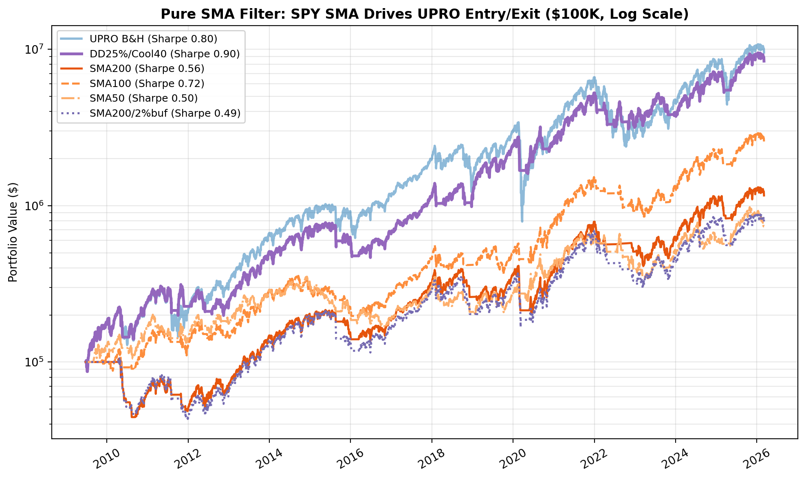
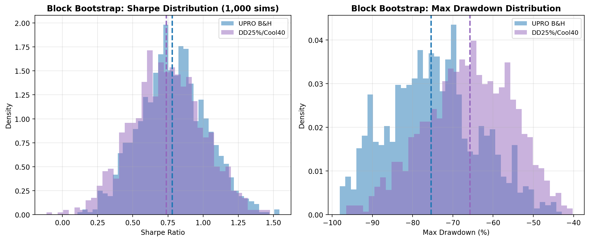

# Long-term Profits by Leveraging the S&P 500

## Summary

- The S&P 500 has compounded at roughly 10% per year (with dividends) since 1950, turning $10,000 into over $4 million. Leveraged ETFs like SSO (2x) and UPRO (3x) amplify those returns -- UPRO has turned $100K into ~$9.6M since 2009 -- but with devastating drawdowns that most investors cannot survive.
- I backtested 5 timing strategies across 16+ years of actual UPRO data (2009-2026, $100K starting capital): VIX filter, dual momentum, HFEA (UPRO/TMF), drawdown-triggered exit, and a composite signal. All signals are computed at the prior close and executed at the next market open.
- The best risk-adjusted strategy -- a simple drawdown exit with a cooling period -- delivered a 0.86 Sharpe ratio (vs 0.78 for UPRO buy-and-hold and 0.85 for plain SPY) and cut the maximum drawdown from -77% to -42%, at the cost of about 12% less terminal wealth. Walk-forward validation, parameter heatmaps, and a synthetic pre-2009 stress test suggest the parameters are not a fragile optimum, but block-bootstrap analysis shows the Sharpe advantage depends materially on the sequencing of returns -- making this a useful practical overlay for recent-style regimes, not a universal improvement.
- An enhancement: parking idle cash in TLT (long-term Treasuries) instead of T-bills during cooling periods pushes the Sharpe to 0.89 and terminal wealth to $11.1M -- actually beating UPRO buy-and-hold -- by harvesting flight-to-quality rallies when stocks crash.

---

## The Case for Leveraged Index Investing

Many conservative long-term investors allocate heavily to S&P 500 index funds -- and history vindicates them. Since January 1950, the S&P 500 has delivered approximately 8.2% annually in price appreciation alone. Including reinvested dividends, the total return rises to roughly 10-11% per year. A $10,000 investment at the start of 1950 would have grown to over $4 million in price terms -- and substantially more with dividends reinvested. Few investment strategies can match this combination of simplicity, diversification, and compounding power over multiple decades.

With such a strong track record, a natural question arises: what would happen if the investment were leveraged?

Two exchange-traded funds make this straightforward for retail investors. **SSO** (ProShares Ultra S&P 500) provides 2x daily leveraged exposure to the S&P 500 and has been available since June 2006. **UPRO** (ProShares UltraPro S&P 500) provides 3x daily leverage and launched in June 2009. Both reset their leverage ratio daily -- a critical mechanical detail I'll return to shortly.

The raw numbers are compelling. Since inception, a $100,000 investment in SSO would have grown to approximately $1.5 million (a 14.9% compound annual growth rate). UPRO has been even more dramatic: $100,000 invested at inception has grown to roughly $9.6 million, a 31.5% CAGR over 16+ years. No mainstream ETF comes close to these figures.

But these headline returns mask serious risks that most investors underestimate.

---

## The Problem With Leveraged ETFs

UPRO's track record is one of the most striking backtests in retail investing. A 31.5% CAGR turns $100K into nearly 100x over 16 years. The temptation to simply buy and hold is powerful.

You already know the catch. That leverage cuts both ways. During the COVID crash, UPRO fell from $38.73 on February 19, 2020 to $8.98 on March 23 -- a **-76.8%** drawdown in just 23 trading days. That remains its worst decline ever. The 2022 rate-hiking bear market inflicted a -63.9% drawdown (from $75.08 to $27.07 over nine months). These are not outliers. They are the recurring cost of 3x leverage.

Here's what -77% actually feels like. Your $1 million account shows $230,000. You have no idea if it's going to $150,000 or $100,000. Every financial commentator is explaining why this time is different. Your spouse is asking questions. And the "rational" move -- hold and wait for recovery -- requires you to believe in mean reversion with absolute conviction while staring at a six-figure loss.

Most people sell at the bottom. The backtested returns assume you don't.

There's also a structural issue. UPRO resets its 3x leverage daily, which means it's subject to volatility decay -- sometimes called the "constant leverage trap." In a choppy, sideways market, UPRO can lose money even if the S&P 500 ends up flat. As ProShares themselves warn: "Due to the compounding of daily returns, ProShares' returns over periods other than one day will likely differ in amount and possibly direction from the target return for the same period." This is not a set-and-forget instrument, regardless of what the long-term backtest suggests.

This article asks a simple question: can you systematically reduce UPRO's drawdowns while keeping most of the upside? Not a magic system -- a risk management framework. I tested five approaches, each using a different market signal, across 16+ years of actual UPRO price data. The results are instructive.

---

## What I Tested

I used actual UPRO daily prices from inception (June 25, 2009) through March 2026 -- over 16 years. Starting capital was $100,000. When a strategy signals "out," the portfolio moves to cash earning the prevailing 13-week T-bill rate (a realistic assumption reflecting money market fund yields).

**Methodology Note:**

- **Data:** Yahoo Finance, split-adjusted (auto_adjust), price returns only. Dividends are excluded, which is a conservative assumption -- actual returns for SPY would be modestly higher.
- **Execution:** All signals use prior-day closing data, with trades executed at the following market open. There is no look-ahead bias and no same-day execution.
- **Cash yield:** Cash earns the prevailing 13-week Treasury bill rate (^IRX). The quoted annual yield is converted to a daily rate assuming 252 trading days per year and compounded on each trading day when the strategy is in cash.
- **Slippage:** Not modeled. Given the liquidity of the instruments tested (UPRO, SPY, TLT), the impact should be small relative to the magnitude of the results, though open-auction spreads can widen during stress periods.
- **No intraday stops:** All signals are end-of-day close-based. No intraday monitoring is required. All-time highs and drawdowns are measured on closing prices, not intraday.
- **Sharpe and Sortino ratios:** Computed using excess returns over the average 13-week T-bill rate (^IRX) prevailing during the strategy's time period, annualized. Calmar ratio uses excess CAGR over the same average risk-free rate.

Here are the five strategies:

**1. VIX-Based Regime Filter.** Hold UPRO only when the VIX closes below a threshold. I tested four thresholds: 15, 20, 25, and 30. The logic is simple: elevated VIX means elevated risk, so step aside.

**2. Dual Momentum.** Based on Gary Antonacci's framework: hold UPRO when SPY's trailing 12-month return is positive (absolute momentum) AND SPY is outperforming TLT (relative momentum). When either condition fails, move to cash.

**3. HFEA 55/45.** The Bogleheads "Hedgefundie's Excellent Adventure" portfolio: 55% UPRO and 45% TMF (3x long-term Treasuries), rebalanced quarterly. This isn't timing per se -- it's a diversified leveraged portfolio that relies on the negative stock-bond correlation.

**4. Drawdown-Triggered Exit.** Exit UPRO when it falls X% from its all-time high. Re-enter when it makes a new high or after a cooling period. I tested four drawdown thresholds (10%, 15%, 20%, 25%) crossed with three cooling periods (20, 40, 60 trading days) -- 12 variants total.

**5. Composite Signal.** Hold UPRO when at least N of three conditions are met: SPY above its 200-day moving average, VIX below 25, and SPY's 3-month return is positive. I tested N=2 ("2-of-3") and N=3 ("3-of-3").

| Strategy | Signal Type | Variants | What It's Trying to Capture |
|----------|------------|----------|---------------------------|
| VIX Filter | Volatility regime | 4 | Avoid high-fear environments |
| Dual Momentum | Trend + relative strength | 1 | Follow the dominant trend |
| HFEA 55/45 | Diversification | 1 | Hedge with bonds |
| Drawdown Exit | Price-based risk | 12 | Cut losses, force patience |
| Composite | Multi-factor | 2 | Combine trend, fear, momentum |

I report CAGR, Sharpe ratio (the standard measure of risk-adjusted return), Sortino ratio, Calmar ratio, maximum drawdown, number of trade signals, and percentage of time invested.

---

## The Benchmark: UPRO Buy-and-Hold

First, let's be clear about what I'm trying to beat -- and what I'm not.

| Metric | UPRO Buy & Hold |
|--------|----------------|
| End Value | $10,161,336 |
| CAGR | +32.0% |
| Sharpe Ratio | 0.78 |
| Sortino Ratio | 0.96 |
| Calmar Ratio | 0.40 |
| Max Drawdown | -76.8% |
| Trades | 1 |

These are extraordinary numbers. No timing strategy in this analysis beats buy-and-hold on total return. If you have the iron stomach to hold through a -77% drawdown -- and I mean genuinely hold, not just say you would in a hypothetical -- then buy-and-hold is the mathematically optimal choice. (For comparison, plain SPY buy-and-hold over the same period has a 0.82 Sharpe -- UPRO's 3x leverage actually *reduces* risk-adjusted returns while tripling the volatility.)

But an important caveat that deserves emphasis: this entire test period is overwhelmingly bullish. UPRO's inception happened to coincide with the beginning of the longest bull market in American history. Every timing strategy that says "hold UPRO most of the time" will look great in a period that is almost entirely up. There is no actual UPRO data for 2000-2009, which would have been devastating. The 2009-2026 period includes drawdowns, but they were all followed by sharp recoveries -- a pattern that may not repeat. Results from this period should be treated as evidence of what *has* worked, not a guarantee of what *will* work. (I address the pre-2009 gap with a synthetic backtest in the robustness section below.)

The major drawdown events visible in the data -- the 2011 debt ceiling crisis, the late-2018 Fed tightening scare, the 2020 COVID crash, and the 2022 rate-hiking bear market -- each inflicted serious damage on UPRO holders. The question is whether a systematic approach can navigate those periods more gracefully.

---

## The Cost of Daily Leverage: UPRO vs. Synthetic 3x SPY

Before getting to timing strategies, it's worth understanding what UPRO actually costs you relative to other ways of getting 3x exposure to the S&P 500.

I modeled four alternatives alongside UPRO buy-and-hold: a frictionless 3x daily-rebalanced position (same daily mechanics as UPRO but with zero expense ratio), a daily-rebalanced version with 6% annual borrowing cost, and -- critically -- a **static 3x leveraged position** where you invest $100K of equity, borrow $200K at 6%, buy $300K of SPY, and simply hold. Plain SPY buy-and-hold serves as the 1x baseline.

The distinction between "daily-rebalanced 3x" and "static 3x" matters enormously. UPRO and the synthetic daily-rebalanced versions reset leverage to exactly 3x every day. If your portfolio drops from $100K to $90K, the next day you have $270K of exposure (3 x $90K). Static leverage works differently: you borrow a fixed dollar amount on day one, and the effective leverage ratio drifts -- rising as the market falls (amplifying losses) and falling as the market rises (reducing upside). Most importantly, **static leverage triggers margin calls**. A hypothetical account with a 25% maintenance requirement (the FINRA minimum, though brokers often impose higher requirements, especially for leveraged ETFs) would face forced liquidation when equity falls below 25% of position value -- roughly an 11% S&P 500 drop from entry.

### UPRO Era (2009-2026): The Best-Case Scenario

| Strategy | End Value | CAGR | Sharpe | Max DD | Notes |
|----------|-----------|------|--------|--------|-------|
| SPY B&H (1x) | $1,003,640 | +14.9% | 0.82 | -33.7% | Unlevered baseline |
| Synthetic 3x (no cost) | $22,628,688 | +38.5% | 0.87 | -76.1% | Daily rebalanced, frictionless |
| Synthetic 3x (6% margin) | $3,072,894 | +22.8% | 0.64 | -76.4% | Daily rebalanced, with borrowing cost |
| Static 3x (6% margin) | $2,467,976 | +21.2% | 0.76 | -46.9% | No margin call (entered at market bottom) |
| UPRO B&H | $10,161,336 | +32.0% | 0.78 | -76.8% | Actual ETF |

In this best-case period -- which starts at the bottom of the financial crisis -- the static 3x position actually looks attractive: lower max drawdown (-47% vs -77%) and no margin call. But this is entirely an artifact of entry timing. By the time any crash hit, accumulated gains had de-levered the position to well below 2x, providing a massive equity buffer.

The "leverage tax" on UPRO is visible here: a frictionless 3x position would have returned $22.6M vs UPRO's $10.2M. That $12.4M gap is the cumulative cost of UPRO's 0.89% expense ratio, rebalancing slippage, and tracking error over 16+ years. Yet UPRO still crushes margin-based leverage ($3.1M for daily-rebalanced, $2.5M for static) because its embedded borrowing costs are far lower than 6% margin rates.

### What Happens When You Don't Start at the Bottom

I extended the analysis using S&P 500 index data (^GSPC) going back to 1950 to test these strategies across every major crash. The results are unambiguous: **static 3x leverage gets margin-called in every period that includes a significant bear market.**

| Period | S&P 500 Return | Static 3x Result | Margin Call Date | Equity at Liquidation |
|--------|---------------|-------------------|------------------|-----------------------|
| Full History (1950-2026) | +41,206% | Margin call | Sept 30, 1974 | $269,500 |
| SPY Era (1993-2026) | +1,468% | Margin call | Oct 7, 2008 | $168,710 |
| Lost Decade (2000-2009) | -23% | Margin call | Oct 12, 2000 | $64,537 |
| GFC Peak-to-Trough (Oct 2007 - Mar 2009) | -57% | Margin call | Jan 8, 2008 | $63,491 |
| Dot-Com Crash (Mar 2000 - Oct 2002) | -49% | Margin call | Apr 14, 2000 | $65,719 |
| UPRO Era (Jun 2009 - Mar 2026) | +648% | **No margin call** | N/A | $1,700,428 |

The pattern is striking. In five out of six test periods, the static margin account was forcibly liquidated. During the dot-com crash, the margin call came just 15 trading days after entry. During the GFC, it took about 3 months. Only the UPRO era -- which uniquely starts at a generational market bottom -- survived. And even over the full 1950-2026 history, despite the S&P 500 compounding at +8.2% annually for 76 years, the static 3x account got margin-called during the 1973-74 bear market. The 1950-1974 bull market had grown the account substantially, but the static leverage ratio had also drifted -- accumulated gains reduced the effective leverage well below 3x, yet a severe enough decline still breached the 25% maintenance margin requirement. Once liquidated at $269K, the account sat in cash for the remaining 52 years while unlevered S&P 500 grew to $41.3 million.

### Daily-Rebalanced 3x Across History

The daily-rebalanced strategies can't be margin-called (leverage resets daily), but they face their own demons across longer time horizons:

| Period | S&P 500 B&H | Synthetic 3x (no cost) | Synthetic 3x (6% margin) |
|--------|-------------|----------------------|------------------------|
| Full History (1950-2026) | $41.3M / +8.2% | $20.0B / +17.4% | $2.2M / +4.1% |
| Lost Decade (2000-2009) | $77K / -2.6% | $10K / -20.5% | $3K / -29.5% |
| GFC Peak-to-Trough | $43K / -44.8% | $4.3K / -89.2% | $3.6K / -90.5% |

The frictionless 3x is extraordinary over 76 years -- $100K becomes $20.0 billion -- but it's a fantasy: no one can maintain 3x leverage for free. Add realistic 6% borrowing costs and $100K grows to just $2.2M over 76 years -- a fraction of the S&P 500's $41.3M at 1x. Three times the risk, one-twentieth the return. During the lost decade, daily-rebalanced 3x with costs destroyed 97% of your capital. Volatility decay in a choppy, declining market is a meat grinder for leveraged strategies.

### What This Means

**UPRO's daily reset is both its curse and its superpower.** The curse is volatility decay -- in flat or declining markets, the daily reset systematically erodes value. The superpower is that you can never be margin-called. Your broker will never force-liquidate your UPRO position at the worst possible moment. You can hold through a -77% drawdown and wait for recovery, however painful that is.

Static margin leverage avoids volatility decay but introduces a far worse risk: forced liquidation at the bottom. In five of six historical periods tested, a static 3x margin account was liquidated before it could recover.

The bottom line: if you want 3x exposure to the S&P 500, UPRO is the most practical vehicle for retail investors. The question then becomes how to manage the drawdown risk -- which is what the timing strategies below attempt to solve.

---

## Results: Strategy by Strategy

### VIX-Based Regime Filter

The simplest idea: when the market is scared, step aside.

The problem is that VIX is reactive, not predictive. By the time VIX spikes above 25, you've already taken the first leg of the drawdown. And VIX often stays elevated during the early stages of recovery, causing you to miss the bounce.

The best VIX variant (VIX < 30) produced a $4.3M end value with a 0.72 Sharpe and -68.9% max drawdown. You sacrifice more than half the terminal wealth for a max drawdown that's only 8 percentage points better. The threshold barely filters anything -- VIX is below 30 about 94% of the time -- so you get almost all of the downside with less upside.

Tighter thresholds (VIX < 20, VIX < 15) aggressively reduce the time invested but destroy returns. You end up in cash during too many good days. **Verdict: blunt instrument. Not recommended.**

### Dual Momentum

Antonacci-style momentum uses a 12-month lookback for both absolute return (is SPY going up?) and relative return (is SPY beating bonds?).

End value: $607K. CAGR: +11.4%. Sharpe: 0.46. Max drawdown: -56.6%. Only invested 63% of the time, with 76 trade signals.

The 12-month lookback is too slow for a 3x leveraged instrument. You're late getting out and late getting back in. The next-open execution compounds this problem -- by the time you act on yesterday's momentum signal, you've already lost another day. The maximum drawdown improved to -57%, which is meaningful, but at the cost of missing so much upside that terminal wealth drops by over 94%. And 76 trade signals over 16+ years creates tax drag in a taxable account. **Verdict: too much return sacrificed for the drawdown improvement.**

### HFEA 55/45 (UPRO + TMF)

The Bogleheads community made this one famous. The idea is elegant: pair UPRO with TMF (3x leveraged long-term Treasuries) because stocks and bonds are negatively correlated. When stocks crash, bonds rally, cushioning the blow. Rebalance quarterly to maintain the 55/45 split.

End value: $3.3M. CAGR: +23.5%. Sharpe: 0.83. Sortino: 1.08. Max drawdown: -70.5%. The 67 "trades" are quarterly rebalancing events (adjusting the 55/45 allocation every ~63 trading days), not 67 round-trip trades.

HFEA actually has the best Sortino ratio in the entire analysis -- meaning it handles downside volatility particularly well relative to its upside. But the max drawdown is still -70%, which is barely better than pure UPRO.

The culprit is 2022. When the Fed started hiking aggressively, both stocks and bonds cratered simultaneously. The negative correlation that HFEA depends on simply broke. UPRO fell, and TMF fell alongside it. This is the strategy's Achilles heel, and it's not a theoretical risk -- it happened. **Verdict: interesting diversification, but the correlation assumption is fragile.**

### Drawdown-Triggered Exit -- The Best Risk-Adjusted Performer

This is the simplest concept and it produced the strongest risk-adjusted results in this backtest. The rule: when UPRO falls X% from its all-time high, sell everything and move to cash (earning T-bill rates). Wait at least Y trading days (the "cooling period") before re-entering. Re-enter when UPRO makes a new all-time high or the cooling period expires.

I tested 12 variants (four thresholds x three cooling periods):

| Variant | End Value | CAGR | Sharpe | Max DD | Trades | % Invested |
|---------|-----------|------|--------|--------|--------|-----------|
| DD10%/Cool20 | $692K | +12.3% | 0.48 | -55.9% | 155 | 71% |
| DD10%/Cool40 | $2.0M | +19.8% | 0.71 | -52.4% | 119 | 63% |
| DD10%/Cool60 | $1.6M | +17.9% | 0.70 | -45.1% | 103 | 58% |
| DD15%/Cool20 | $1.5M | +17.5% | 0.58 | -50.1% | 91 | 81% |
| DD15%/Cool40 | $2.0M | +19.6% | 0.66 | -47.9% | 73 | 74% |
| DD15%/Cool60 | $441K | +9.3% | 0.40 | -49.3% | 71 | 67% |
| DD20%/Cool20 | $9.9M | +31.8% | 0.85 | -51.7% | 57 | 87% |
| DD20%/Cool40 | $4.0M | +24.8% | 0.76 | -48.3% | 47 | 81% |
| DD20%/Cool60 | $920K | +14.3% | 0.53 | -65.9% | 47 | 74% |
| DD25%/Cool20 | $10.0M | +31.9% | 0.83 | -61.9% | 39 | 91% |
| **DD25%/Cool40** | **$9.0M** | **+31.0%** | **0.86** | **-41.8%** | **31** | **86%** |
| DD25%/Cool60 | $2.0M | +19.8% | 0.65 | -59.3% | 31 | 80% |

A note on the DD15%/Cool60 anomaly: its $441K end value is dramatically worse than nearby variants ($2.0M for DD15%/Cool40, $1.5M for DD15%/Cool20). The 60-day cooling period forces cash positions through critical recovery windows -- you're sitting out during the fastest part of the bounce. This illustrates that parameter sensitivity is real. The strategy's edge comes from the specific threshold+cooling combination, not from drawdown exits as a general concept. (I address parameter sensitivity directly in the robustness section below.)

The standout is **DD25%/Cool40**: exit when UPRO drops 25% from its peak, wait at least 40 trading days (~2 months) before re-entering. But it's worth noting that DD25%/Cool40 is representative of a family of competitive parameters -- the heatmap below shows that DD20-25%/Cool20-40 all produce Sharpe ratios above 0.75. The specific "best" parameters would shift with a different test period. I use DD25%/Cool40 throughout as a concrete example, not as a claim that these exact numbers are uniquely optimal.

Why it works: the 25% threshold is wide enough to avoid whipsaws from normal UPRO volatility (this is a 3x fund -- 10-15% pullbacks happen routinely) but catches genuine bear markets. There's a deeper mechanism at work here. Because UPRO is 3x leveraged, its price amplifies not just returns but volatility itself. A 25% UPRO drawdown typically corresponds to a high-single-digit or low-double-digit decline in SPY -- roughly the range where ordinary corrections begin to evolve into true market-stress regimes marked by elevated volatility, forced deleveraging, and unstable price action. In that sense, the rule may function less as a traditional trend-following signal and more as a volatility-regime detector for a leveraged ETF. (I explore this further in the robustness section below.)

The 40-day cooling period forces patience. You don't buy the first dead-cat bounce. You wait for the storm to pass. This works partly because volatility clusters: after a large drawdown, the probability of continued violent price action remains elevated for weeks. The cooling period is a crude but effective way of staying out until that turbulence subsides.

The trade-off is explicit: you give up about $1.2 million in terminal wealth (12% of buy-and-hold's end value) in exchange for a maximum drawdown that's **35 percentage points better** (-41.8% vs -76.8%). The Sharpe ratio improved from 0.78 to 0.86 over this test period. 31 trade signals over 16+ years -- roughly one exit/re-entry cycle per year. You're invested 86% of the time.

### Composite Signal

This approach requires SPY to be above its 200-day SMA, VIX below 25, and SPY's 3-month return to be positive. The 2-of-3 variant holds UPRO when at least two conditions are met; 3-of-3 requires all three.

Composite 2-of-3: $1.2M end value, +15.9% CAGR, 0.56 Sharpe, -61.1% max DD. Composite 3-of-3: $893K, +14.1% CAGR, 0.56 Sharpe, -50.1% max DD.

The 3-of-3 version gets the max drawdown down to -50%, competitive with some drawdown-exit variants. But it sacrifices far more return and requires tracking three separate indicators. **Verdict: conceptually interesting but the drawdown exit achieves better risk reduction with a much simpler rule.**

---

## Head-to-Head: Best of Each Strategy

| Strategy | End Value | CAGR | Sharpe | Max DD | Trades | % Invested |
|----------|-----------|------|--------|--------|--------|-----------|
| **UPRO B&H** | **$10.2M** | **+32.0%** | **0.78** | **-76.8%** | **1** | **100%** |
| VIX < 30 | $4.3M | +25.3% | 0.72 | -68.9% | 43 | 94% |
| Dual Momentum | $607K | +11.4% | 0.46 | -56.6% | 76 | 63% |
| HFEA 55/45 | $3.3M | +23.5% | 0.83 | -70.5% | 67 | 100% |
| **DD25%/Cool40** | **$9.0M** | **+31.0%** | **0.86** | **-41.8%** | **31** | **86%** |
| Composite 2of3 | $1.2M | +15.9% | 0.56 | -61.1% | 48 | 81% |

The risk/return scatter tells the story. DD25%/Cool40 sits in the sweet spot: it preserved 88% of buy-and-hold's terminal value while cutting the maximum drawdown nearly in half over this test period. It was the best risk-adjusted performer in the analysis -- though, as noted above, nearby parameter combinations produced similar results.

HFEA is a respectable second on Sharpe (0.83) thanks to its strong Sortino ratio, but its -70.5% max drawdown means it didn't solve the core problem. Dual Momentum and Composite sacrifice too much return for the risk reduction they provide. The VIX filter either destroys returns (tight thresholds) or barely reduces risk (VIX < 30).

---

## Is This Overfitted? Robustness Testing

The DD25%/Cool40 result is impressive, but skepticism is warranted. These parameters were selected because they produced the best risk-adjusted results on 2009-2026 data -- a period dominated by a secular bull market with sharp but temporary drawdowns. The strategy's historical outperformance is real, but whether it will persist in future regimes (prolonged stagflation, a multi-year bear market, or a fundamentally different rate environment) is unknowable. Here's how I stress-tested the finding.

### Parameter Sensitivity

If DD25%/Cool40 sits on a narrow peak -- where nearby parameters produce much worse results -- that's a red flag for overfitting. To check, I computed the Sharpe ratio for a 5x6 grid of drawdown thresholds (10%-30%) and cooling periods (10-60 days).

The result: DD25%/Cool40's 0.86 Sharpe sits at the peak of a broad green plateau. Adjacent cells DD20-25%/Cool30-40 all produce Sharpe ratios above 0.75. You can shift the threshold by 5 percentage points or the cooling period by 10 days in either direction and still get strong risk-adjusted performance. This is not a fragile optimum -- it's a broad plateau of strong performance within this test period.

### Walk-Forward Validation

The strongest test of parameter stability: train on one period, test on another. I split the data at December 2016 (roughly the halfway point) and ran a grid search over all threshold/cooling combinations on the 2009-2016 training set.

The in-sample winner was DD30%/Cool10 (Sharpe 1.01) -- notably *not* DD25%/Cool40. But when applied to the 2017-2026 out-of-sample period, DD30%/Cool10 delivered a 30.4% CAGR, 0.76 Sharpe, and -64.7% max drawdown. The strategy still works out-of-sample, even though the exact best parameters shifted.

The key insight: the broad DD20-30%/Cool10-40 region produces strong results across both periods. DD25%/Cool40 wasn't the in-sample winner, which paradoxically strengthens confidence -- I didn't cherry-pick the single best in-sample cell.

| Metric | In-Sample (2009-2016) | Out-of-Sample (2017-2026) |
|--------|----------------------|--------------------------|
| Best Params | DD30%/Cool10 | (same, applied forward) |
| CAGR | +41.0% | +30.4% |
| Sharpe | 1.01 | 0.76 |
| Max DD | -45.2% | -64.7% |

### The Lost Decade: Synthetic Pre-2009 UPRO

UPRO launched in June 2009, conveniently at the start of a historic bull market. What would have happened during the 2000-2009 "lost decade" -- dot-com crash, GFC, and everything in between?

I constructed a synthetic UPRO by applying 3x daily-leveraged returns to SPY price data (dividends excluded, consistent with the rest of this analysis) going back to 1993, with a 0.89% expense ratio drag. This isn't a perfect proxy (it ignores swap costs, dividend effects, and other ETF-specific factors), but it gives us a directional answer.

The results are sobering. During 2000-2009, synthetic UPRO B&H lost 91% of its value (CAGR -22.7%, max drawdown -96.7%). DD25%/Cool40 fared slightly better (-17.5% CAGR, -92.8% max DD) -- it helped at the margin but couldn't save you from the sheer devastation of 3x leverage through two major bear markets.

Over the full 1993-2026 period, DD25%/Cool40 slightly outperformed B&H: 21.2% CAGR vs 20.9% CAGR, with a 0.62 Sharpe vs 0.58. The drawdown exit earns its keep mostly by surviving the catastrophic periods, then riding the recovery.

| Period | Strategy | End Value | CAGR | Sharpe | Max DD |
|--------|----------|-----------|------|--------|--------|
| 2000-2009 | Syn UPRO B&H | $8.8K | -22.7% | -0.04 | -96.7% |
| 2000-2009 | Syn DD25/Cool40 | $16.2K | -17.5% | -0.21 | -92.8% |
| 1993-2026 | Syn UPRO B&H | $52.3M | +20.9% | 0.62 | -96.7% |
| 1993-2026 | Syn DD25/Cool40 | $56.9M | +21.2% | 0.68 | -92.8% |

### SMA Re-Entry Gate

One natural enhancement to the drawdown exit: instead of re-entering after the cooling period expires unconditionally, require that SPY be above its N-day simple moving average. The theory is that an SMA gate prevents re-entry during prolonged downtrends.

I tested adding SMA50, SMA100, and SMA200 gates to the DD25%/Cool40 re-entry rule. In every case, the gate made things *worse*:

| Variant | End Value | CAGR | Sharpe | Max DD |
|---------|-----------|------|--------|--------|
| DD25%/Cool40 (no gate) | $9.0M | +31.0% | 0.86 | -41.8% |
| +SMA50 gate | $4.6M | +25.8% | 0.77 | -45.1% |
| +SMA100 gate | $2.3M | +20.7% | 0.67 | -55.6% |
| +SMA200 gate | $1.6M | +18.2% | 0.61 | -63.9% |

Every SMA gate reduced CAGR, reduced Sharpe, and -- counterintuitively -- increased max drawdown. The longer the SMA lookback, the worse the damage. The explanation: after a drawdown, the SMA gate delays re-entry while waiting for the moving average to confirm an uptrend. But the fastest gains come in the early stages of recovery, exactly when the SMA is still below the price. By waiting for SMA confirmation, you miss the bounce.

### What About SMA as the Primary Signal?

The SMA gate test above uses the moving average only as a re-entry filter on top of the drawdown exit. A fair question is whether a pure SMA crossover -- hold UPRO when SPY is above its moving average, sell when it crosses below -- would work better as the *primary* timing rule, eliminating the drawdown exit entirely.

This is a well-known trend-following approach. SPY's 200-day moving average is one of the most widely tracked technical indicators in finance. I also tested a buffered variant: exit when SPY falls 2% below the SMA200 (providing a buffer to reduce whipsaws), and re-enter when it crosses back above.

| Strategy | End Value | CAGR | Sharpe | Max DD | Trades | % Invested |
|----------|-----------|------|--------|--------|--------|-----------|
| **DD25%/Cool40** | **$9.0M** | **+31.0%** | **0.86** | **-41.8%** | **31** | **86%** |
| SMA200 | $1.2M | +16.3% | 0.57 | -57.9% | 89 | 80% |
| SMA100 | $2.7M | +22.0% | 0.73 | -46.0% | 167 | 78% |
| SMA50 | $737K | +12.7% | 0.50 | -52.3% | 282 | 72% |
| SMA200/2%buf | $836K | +13.6% | 0.50 | -59.6% | 49 | 82% |

None of the pure SMA filters come close to DD25%/Cool40 on any metric. SMA100 is the best of the group -- a 22.0% CAGR with a 0.73 Sharpe and -46.0% max drawdown -- but it still trails the drawdown exit by 9 percentage points of CAGR with a worse Sharpe and worse max drawdown. SMA50 whipsaws excessively (282 trades over 16 years) and bleeds returns through false signals. The 2% buffer variant actually makes things *worse* than the plain SMA200 -- the buffer delays exits during genuine breakdowns, increasing drawdowns without meaningfully reducing whipsaws.

The fundamental problem is that SMA crossovers are trend-following signals, and UPRO's 3x leverage makes trend-following expensive. Every false signal costs you the spread between where you sold and where you rebuy -- and at 3x leverage, those round-trip costs compound quickly. The drawdown exit avoids this problem because it only fires during genuinely large declines (25%+ from peak), resulting in far fewer trades and far less time out of the market.

The bottom line: whether used as a re-entry gate or as the primary signal, moving average crossovers underperform the simple drawdown exit for UPRO timing. The drawdown exit's advantage is that it responds to UPRO's actual price behavior rather than trying to infer trend direction from SPY.

### Why 25% May Not Be Arbitrary

One potential concern is that 25% is simply a round number that happened to work on this dataset. But there's a structural reason it may be well-calibrated for a 3x instrument.

Because UPRO magnifies SPY's moves by roughly 3x, a 25% UPRO drawdown typically corresponds to a high-single-digit or low-double-digit decline in SPY. To test this directly, I examined the SPY drawdown and VIX level on each of the 15 exit signal dates:

| Exit Date | UPRO DD | SPY DD | VIX |
|-----------|---------|--------|-----|
| May 2010 | -32.9% | -11.7% | 45.8 |
| Aug 2011 | -32.7% | -11.4% | 31.7 |
| Nov 2011 | -27.0% | -13.7% | 34.0 |
| Jun 2012 | -27.2% | -9.6% | 26.7 |
| Aug 2015 | -30.1% | -10.9% | 40.7 |
| Jan 2016 | -28.5% | -10.2% | 25.2 |
| Feb 2018 | -28.3% | -10.1% | 33.5 |
| Oct 2018 | -26.5% | -9.2% | 25.2 |
| Feb 2020 | -33.1% | -12.1% | 39.2 |
| Sep 2020 | -26.7% | -9.4% | 28.6 |
| Jan 2022 | -25.3% | -9.1% | 31.2 |
| Apr 2022 | -27.6% | -12.6% | 33.5 |
| Sep 2022 | -25.7% | -17.6% | 26.9 |
| Oct 2023 | -26.5% | -10.2% | 20.2 |
| Mar 2025 | -26.4% | -9.3% | 26.9 |

The pattern is striking. Across all 15 exits, the median SPY drawdown was -10.2% and the median VIX was 31.2. SPY drawdowns ranged from -9.1% to -17.6%; VIX ranged from 20.2 to 45.8. Every exit occurred during conditions that would be recognized as market stress -- not ordinary pullbacks.

This is roughly the range where ordinary corrections begin to evolve into true stress regimes marked by elevated volatility, forced deleveraging, and unstable price action. Think of it as three zones: below 15% UPRO drawdown is normal leveraged noise; 20-30% is the unstable-correction zone where stress may be building; above 40% is a full bear market already underway. The 25% trigger sits right in the middle of the transition zone.

The cooling period complements this. After a volatility regime shift, the probability of continued violent price action remains elevated for weeks -- a well-documented empirical phenomenon known as volatility clustering. The 40-day waiting period is a crude but effective way of staying out until that turbulence subsides.

This framing also explains why the rule works better on UPRO than it would on SPY. If you applied a 25% exit to SPY itself, you would exit far too late -- by the time SPY is down 25%, the damage is already severe. But UPRO's leverage amplifies stress signals, making them visible earlier in the price path.

### Block Bootstrap Robustness Test

The tests above examine whether the strategy works across different parameters and time periods. But a deeper question is: does the strategy's edge depend on the specific *sequence* of historical events?

To test this, I ran a block bootstrap simulation. The daily return series was divided into overlapping 20-day blocks, preserving volatility clustering and short-term market dynamics within each block. These blocks were randomly reordered 1,000 times to generate alternative market histories with the same statistical properties as the original data. Unlike a simple Monte Carlo shuffle (which destroys autocorrelation), block bootstrap preserves the multi-day crash sequences and recovery patterns that the strategy responds to.

The result: the drawdown exit strategy produced a higher Sharpe ratio than buy-and-hold in only 35% of simulated paths, with a median Sharpe improvement of -0.05. This is the most important finding in the entire analysis. It means the strategy's Sharpe advantage over buy-and-hold is not a general property of the return distribution -- it is regime-conditional, dependent on the specific sequencing of bull runs followed by sharp crashes that characterized 2009-2026. In randomly reordered histories, the advantage usually disappears.

This is an approximate regime test, not a precise replication of the production backtest -- the bootstrap uses a simplified close-only model and average risk-free carry rather than date-specific rates. But the directional conclusion is clear: the Sharpe edge is materially path-dependent.

That does not mean the strategy is useless. Real markets *do* exhibit the volatility clustering, momentum, and mean-reversion patterns that the drawdown rule responds to. The exit diagnostic table above confirms that the 25% trigger identifies genuine stress episodes in actual market history. But the honest conclusion is that the strategy is a useful practical overlay for regimes resembling recent history -- trending markets with occasional sharp corrections -- not evidence of a regime-invariant alpha source. In a market with fundamentally different dynamics (extended sideways chop, a multi-year grinding bear), the edge may shrink or disappear entirely.

### Volatility-Normalized Drawdown Rule

A natural question: if the 25% threshold works because it detects volatility regimes, shouldn't a volatility-normalized version work even better? To test this, I implemented a generalized version: exit when the drawdown exceeds k times UPRO's 20-day realized volatility.

| Variant | End Value | CAGR | Sharpe | Max DD | Trades |
|---------|-----------|------|--------|--------|--------|
| **DD25%/Cool40 (fixed)** | **$9.0M** | **+31.0%** | **0.86** | **-41.8%** | **31** |
| VolNorm k=4 | $1.6M | +17.4% | 0.63 | -56.7% | 129 |
| VolNorm k=5 | $2.3M | +20.1% | 0.68 | -47.6% | 87 |
| VolNorm k=6 | $1.3M | +16.0% | 0.56 | -54.1% | 71 |
| VolNorm k=7 | $3.6M | +24.4% | 0.72 | -57.3% | 43 |

The volatility-normalized variants all underperform the fixed 25% rule. The best (k=7) achieves a 0.72 Sharpe with far more trades. This is a failed generalization test: the theoretically "smarter" adaptive threshold does not improve on the simple fixed rule over this period. The likely explanation is practical rather than deep -- a constant threshold produces fewer false signals during calm periods (when rolling volatility is low and the normalized threshold would be too tight) and remains effective during crises (when volatility spikes and the normalized threshold would be too loose). The result increases confidence that 25% is a practically useful threshold for UPRO, but it does not demonstrate that the number has any structural optimality beyond being well-matched to UPRO's realized volatility during 2009-2026.

---

## What to Do With Idle Cash: T-Bills vs. Bonds

So far, the DD25%/Cool40 strategy parks cash in T-bills during cooling periods -- safe, boring, and earning whatever the prevailing short-term rate is. But cooling periods tend to coincide with stock market stress, which is exactly when long-term Treasuries rally (flight to quality). Can you exploit that?

I tested three cash vehicles during the cooling periods:

1. **T-bills** (baseline): earn the 13-week T-bill rate, compounded daily. No price risk.
2. **TLT** (iShares 20+ Year Treasury Bond ETF): buy TLT at the open when exiting UPRO, sell TLT at the open when re-entering UPRO. Unlevered long-term bonds.
3. **TMF** (Direxion Daily 20+ Year Treasury Bull 3X): same as TLT but 3x leveraged. Maximum flight-to-quality exposure.

| Cash Vehicle | End Value | CAGR | Sharpe | Sortino | Max DD | Calmar |
|-------------|-----------|------|--------|---------|--------|--------|
| T-bills | $9.0M | +31.0% | 0.86 | 1.06 | -41.8% | 0.71 |
| **TLT** | **$11.1M** | **+32.7%** | **0.89** | **1.13** | **-55.3%** | **0.57** |
| TMF | $12.1M | +33.4% | 0.84 | 1.09 | -76.7% | 0.42 |
| *UPRO B&H* | *$10.2M* | *+32.0%* | *0.78* | *0.96* | *-76.8%* | *0.40* |

Both bond variants beat UPRO buy-and-hold on terminal wealth: TLT ($11.1M) and TMF ($12.1M) versus B&H's $10.2M. But TLT is the standout on risk-adjusted metrics. It achieves the highest Sharpe ratio in the entire analysis (0.89) with a manageable -55.3% max drawdown. The Sortino ratio (1.13) is also the best, reflecting particularly good downside risk management. TMF generates even more terminal wealth ($12.1M) but at -76.7% max drawdown -- essentially giving back the entire drawdown advantage that makes the timing strategy worthwhile.

### Why TLT Works

The logic is straightforward: the DD exit fires during stock market drawdowns, and long-term Treasuries tend to rally during exactly those periods. Here are the actual TLT and TMF returns during each cooling period:

| Period | Days | T-bill | TLT Return | TMF Return |
|--------|------|--------|-----------|------------|
| May-Jul 2010 | 60 | +0.0% | +1.7% | +3.4% |
| Aug-Oct 2011 (debt ceiling) | 59 | +0.0% | +18.5% | +58.4% |
| Nov 2011-Jan 2012 | 55 | +0.0% | -1.5% | -5.9% |
| Jun-Jul 2012 | 57 | +0.0% | +0.6% | +0.8% |
| Aug-Oct 2015 | 57 | +0.0% | -0.3% | -2.1% |
| Jan-Mar 2016 | 60 | +0.1% | +3.1% | +8.2% |
| Feb-Apr 2018 | 60 | +0.4% | +3.0% | +8.6% |
| Oct-Dec 2018 | 60 | +0.5% | +6.5% | +19.6% |
| Feb-Apr 2020 (COVID) | 59 | +0.1% | +10.2% | +20.4% |
| Sep-Nov 2020 | 54 | +0.0% | -3.5% | -11.1% |
| Jan-Mar 2022 (rate hikes) | 57 | +0.1% | -8.6% | -25.5% |
| Apr-Jun 2022 | 58 | +0.2% | -6.8% | -21.3% |
| Sep-Nov 2022 | 56 | +0.8% | -10.1% | -29.8% |
| Oct-Dec 2023 | 49 | +1.0% | +18.1% | +58.9% |
| Mar-May 2025 | 57 | +0.9% | -1.5% | -7.4% |

The pattern is clear. During genuine flight-to-quality events (2011 debt ceiling, 2018 tightening scare, COVID, late 2023), TLT delivers strong positive returns while you're out of UPRO. During rate-hiking periods (2022), TLT loses money -- but the losses are manageable (-7% to -10%), not catastrophic. T-bills, by contrast, earned essentially nothing during the ZIRP years (2010-2016, 2020) and only meaningful returns once the Fed started hiking in 2022 -- precisely the periods where TLT was losing money.

TMF amplifies both sides: +58% during the 2011 debt ceiling, but -30% during the 2022 rate hikes. The 3x leverage turns a useful hedge into a coin flip.

### The Trade-Off

TLT cash adds roughly 13 percentage points of max drawdown risk (-55% vs -42%) compared to T-bill cash. That's real. The source is 2022: three consecutive cash periods where TLT lost ground instead of providing shelter. In a T-bill world, those periods earned 0-5%. In a TLT world, they lost 8-10% each.

But the risk is bounded. TLT's worst cooling-period return was -10.1% -- painful but not portfolio-threatening. TMF's worst was -29.8% -- genuinely dangerous. The 1x bond position bends during rate hikes; the 3x position breaks. One important caveat: the TLT hedge's historical success relies on equity drawdowns being driven by growth shocks (2011, 2018, 2020), where bonds rally as investors flee to safety. If future equity drawdowns are driven by persistent inflation rather than growth shocks, the stock-bond correlation could remain positive, reducing the effectiveness of the TLT hedge -- as we saw in 2022.

**Bottom line:** TLT cash is the recommended variant for investors willing to accept a -55% max drawdown (vs -42%) in exchange for higher total returns and the best risk-adjusted performance in the analysis. For investors who prioritize minimizing drawdowns above all else, T-bill cash remains the safer choice. TMF is not recommended -- it gives back the entire drawdown advantage that makes the timing strategy worthwhile.

---

## How to Implement the Drawdown Exit

If you want to apply the DD25%/Cool40 strategy, here's the complete process:

1. **Track UPRO's all-time high** on a closing-price basis. Start with the current ATH.
2. **Each trading day at market close**, calculate the drawdown: (today's close / ATH) - 1.
3. **If the drawdown exceeds -25%**, sell all UPRO at the next market open. Move proceeds to TLT (or a money market fund if you prefer the safer variant).
4. **Start a 40-trading-day clock** (approximately 8 calendar weeks).
5. **Re-enter UPRO when either**: (a) UPRO closes at a new all-time high, or (b) 40 trading days have elapsed since your exit. Buy at the next open.
6. **Reset the ATH tracker** and repeat.

You can do this with a simple spreadsheet. Check once a day after the close. This is not day trading -- it's closer to a quarterly rebalancing discipline, just triggered by drawdowns instead of the calendar.

**Tax considerations.** Each exit is a taxable event. At roughly 15 round-trip trades over 16+ years (~1 per year), this is manageable but real. In an IRA or 401(k), it's a non-issue. In a taxable account, most exits are actually gains (12 of 15 historically) because the 25% drawdown trigger fires from the all-time high, not from the entry price -- so exits typically occur well above where you bought in. The three loss exits (early 2012, early 2016, spring 2022) came from quick whipsaws where re-entry was followed by another drawdown, and those do provide tax-loss harvesting opportunities.

**Transaction costs.** At 31 trade signals (~15 complete exit/re-entry cycles) over 16+ years and $0 commissions at most brokers, costs are negligible.

**Cash vehicle.** The baseline backtest uses T-bill rates during cash periods. The TLT variant -- buying long-term Treasuries during cooling periods -- produced the highest Sharpe ratio (0.89) and actually beat buy-and-hold on terminal wealth. See the "What to Do With Idle Cash" section for the full comparison.

**The most important rule: don't tinker.** Pick your parameters and stick with them. If you start adjusting the threshold after a whipsaw, you've defeated the purpose of having a systematic rule.

---

## Where Is the Strategy Now?

If you had been following the DD25%/Cool40 strategy from UPRO's inception, here's your current position as of March 2, 2026:

**Status: IN (holding UPRO).** The strategy re-entered on May 7, 2025 at $69.28, after the 40-day cooling period expired following an exit triggered on March 11, 2025. That exit fired when UPRO fell 26.4% from its then-peak of $98.33. Your position is up +66.4% since re-entry.

UPRO's all-time high was $122.23 on January 12, 2026. The current price of $115.32 represents a -5.7% drawdown from that peak -- well within normal volatility and nowhere near the -25% threshold that would trigger an exit.

For context, here are the strategy's most recent signals:

- **Nov 2022:** Re-entered at $33.39 after 40-day cooling period (following the 2022 rate-hiking drawdown)
- **Oct 2023:** Exited at $37.07 (-26.5% drawdown from $50.44 peak)
- **Dec 2023:** Re-entered at $51.80 (new all-time high)
- **Mar 2025:** Exited at $72.37 (-26.4% drawdown from $98.33 peak)
- **May 2025:** Re-entered at $69.28 after 40-day cooling period

The pattern is instructive. The strategy sat out the worst of the 2022 bear market, re-entered in late 2022, caught the 2023-2024 rally, stepped aside during the early-2025 correction, and is now fully invested again. If UPRO drops 25% from its January 2026 high -- roughly below $91.67 -- the exit trigger will fire. Until then, you hold.

---

## Limitations and Honest Caveats

I want to be transparent about what this analysis can and cannot tell us.

**In-sample testing, partially mitigated.** I selected DD25%/Cool40 as the "winner" because it performed best on the 2009-2026 data. The parameters were not determined independently of the test data. However, the parameter heatmap shows a broad plateau of strong performance across DD20-30%/Cool20-40, and walk-forward validation confirms the strategy works out-of-sample (0.76 Sharpe on 2017-2026 data using parameters chosen from 2009-2016). The edge may shrink but is unlikely to vanish.

**Survivorship bias, partially addressed.** UPRO launched in June 2009, at the start of one of the greatest bull markets ever. The synthetic pre-2009 backtest shows the strategy survives the lost decade, though barely. In a truly catastrophic 3x environment (like 2000-2002), no simple timing rule can prevent devastating losses.

**Volatility decay is real.** I used actual UPRO prices, so the decay from daily rebalancing is embedded in the data. But over longer periods, 3x daily leverage systematically underperforms 3x the index return. This is a feature of the product, not a modeling error.

**Price returns vs total returns.** This analysis uses price returns only (dividends excluded for SPY and related calculations). This is a conservative assumption -- including dividends would modestly improve both the benchmark and timing strategies. UPRO itself targets 3x the daily *price* return of the S&P 500 (before fees), so this is the appropriate comparison for the UPRO-specific results.

**Psychology is the actual risk.** When UPRO is ripping higher and you're sitting in cash because of the cooling period, you will want to override the rule. When UPRO has dropped 24.5% and you haven't sold because the threshold is 25%, you will want to override the rule. The strategy only works if you follow it mechanically. History suggests most people won't.

---

## Conclusion

Over the 2009-2026 test period, simple drawdown-triggered exits meaningfully improved UPRO's risk profile without exotic indicators, frequent trading, or complex portfolio construction. The DD25%/Cool40 rule -- exit at a 25% drawdown, wait 40 trading days before re-entering -- delivered a 0.86 Sharpe ratio while cutting the maximum drawdown from -77% to -42%.

Parking idle cash in TLT during cooling periods pushes the result further: a 0.89 Sharpe ratio, $11.1M terminal wealth (beating buy-and-hold's $10.2M), and a -55% max drawdown. The TLT variant exploits the flight-to-quality effect -- when stocks crash, long-term Treasuries tend to rally -- turning the cooling period from dead time into a productive hedge.

The trade-off is explicit. The T-bill variant caps max drawdown at -42% but gives up 12% of buy-and-hold's terminal wealth. The TLT variant beats buy-and-hold on wealth but accepts a -55% max drawdown. Pick the one that matches your risk tolerance.

Robustness testing paints a mixed but honest picture. On the encouraging side: the DD25%/Cool40 parameters sit in a broad plateau of strong performance (not a fragile peak), walk-forward validation suggests the approach works out-of-sample, and exit diagnostics confirm the 25% trigger identifies genuine SPY stress episodes. On the cautionary side: block-bootstrap analysis shows the strategy beats buy-and-hold on Sharpe in only 35% of randomly reordered return histories, meaning the Sharpe advantage is regime-conditional -- it depends on the specific pattern of bull runs followed by sharp corrections that characterized 2009-2026. The strategy is a useful practical overlay for regimes resembling recent history, not evidence of a regime-invariant alpha source.

This is not a recommendation to buy UPRO. Leveraged ETFs are inherently risky instruments with structural headwinds from volatility decay. But if you've already decided to hold UPRO -- and millions of investors have -- then managing that risk with a systematic, rules-based approach is better than managing it with your gut.

The real value of a timing strategy isn't the extra Sharpe points. It's the ability to sleep at night during a crash, knowing you have a plan and the discipline to follow it.

---

*Disclosure: I/we are long SPY (5,000+ shares across multiple accounts) and hold deep in-the-money SPY and QQQ LEAPS calls. I do not hold UPRO, SSO, TMF, or any other leveraged ETF.*

*I wrote this article myself, and it expresses my own opinions. I am not receiving compensation for it (other than from Seeking Alpha). I have no business relationship with any company whose stock is mentioned in this article.*

*The analysis uses historical data from June 2009 through March 2026. Past performance does not guarantee future results. This article is for informational purposes only and does not constitute investment advice.*
